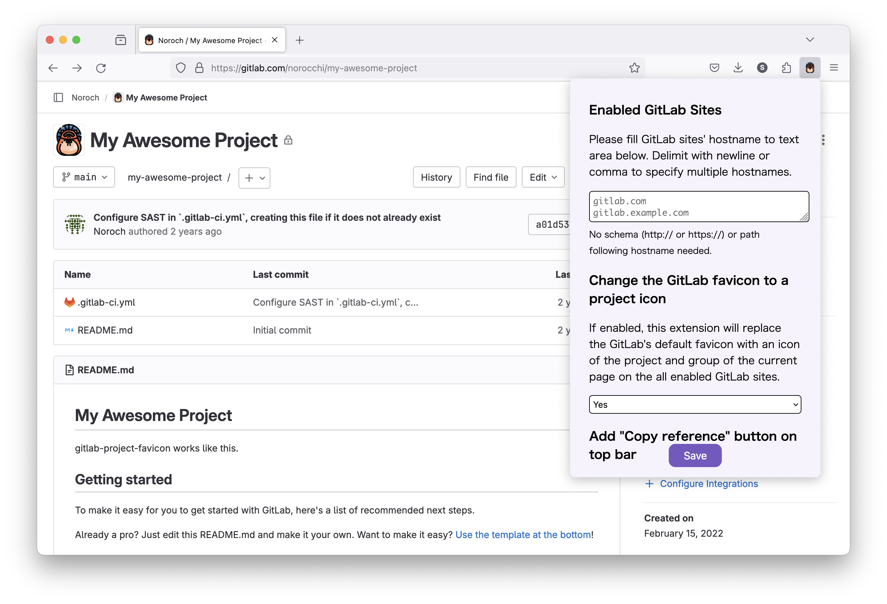
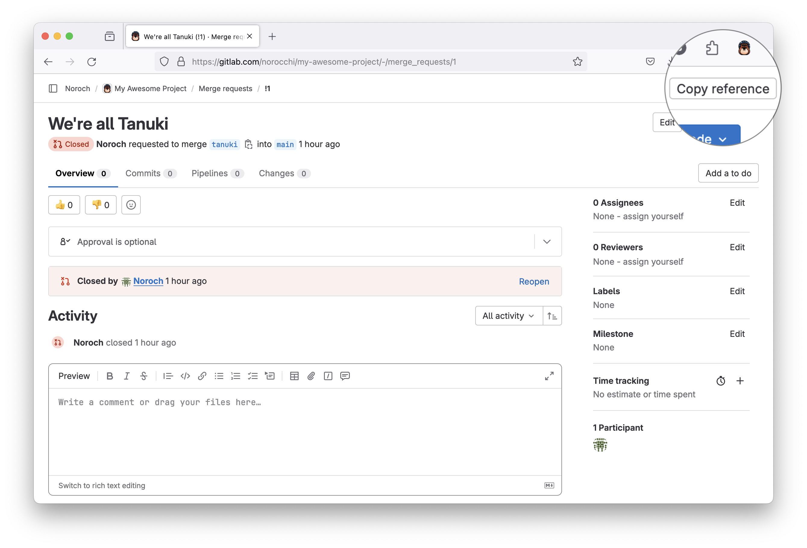
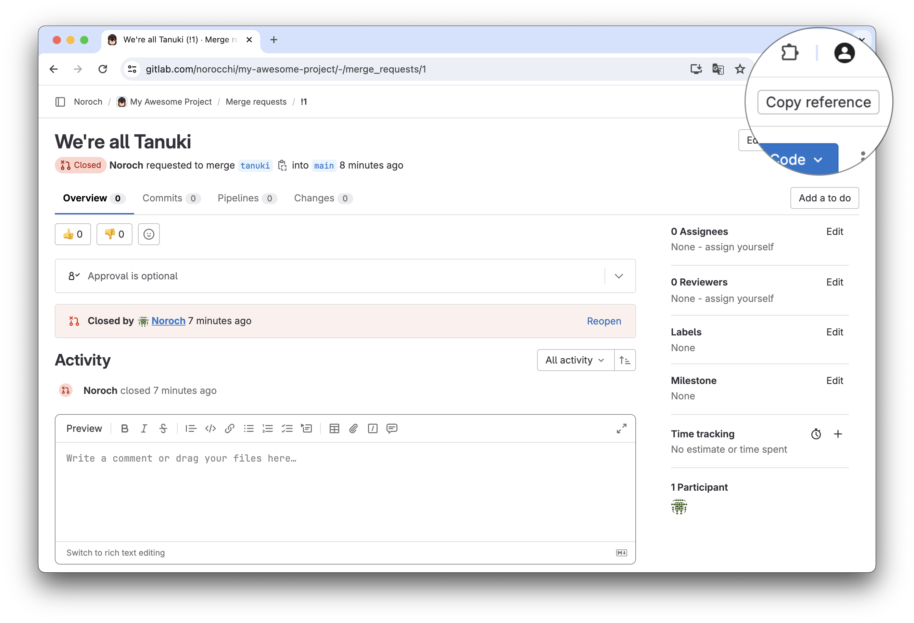

# tanuki-utilities (formerly gitlab-project-favicon)

## Features

* **Change the GitLab favicon to a project icon**; you can easily distinguish many GitLab tabs.  
    
  
* **Add "Copy reference" button on top bar**; the button is always shown for your easy access.  
    
  

## Getting started

Install extension from the store.

* Firefox: https://addons.mozilla.org/firefox/addon/gitlab-project-favicon/
* Chrome: https://chrome.google.com/webstore/detail/gitlab-project-favicon/bakcfpilmcemknpdfdakmfnfikedmodh

## Preferences

#### Enabled GitLab Sites

This extension tries to change favicons in the **all** sites by default. You can specify which GitLab site (e.g. gitlab.com or your self-hosted site) you would like to change favicons.

#### Change the GitLab favicon to a project icon

Yes/No (defaults to Yes)

#### Add "Copy reference" button on top bar

Yes/No (defaults to No)

## Acknowledgements

Raccoon icon that this project use is created by justicon - [Flaticon](https://www.flaticon.com/free-icons/raccoon).
