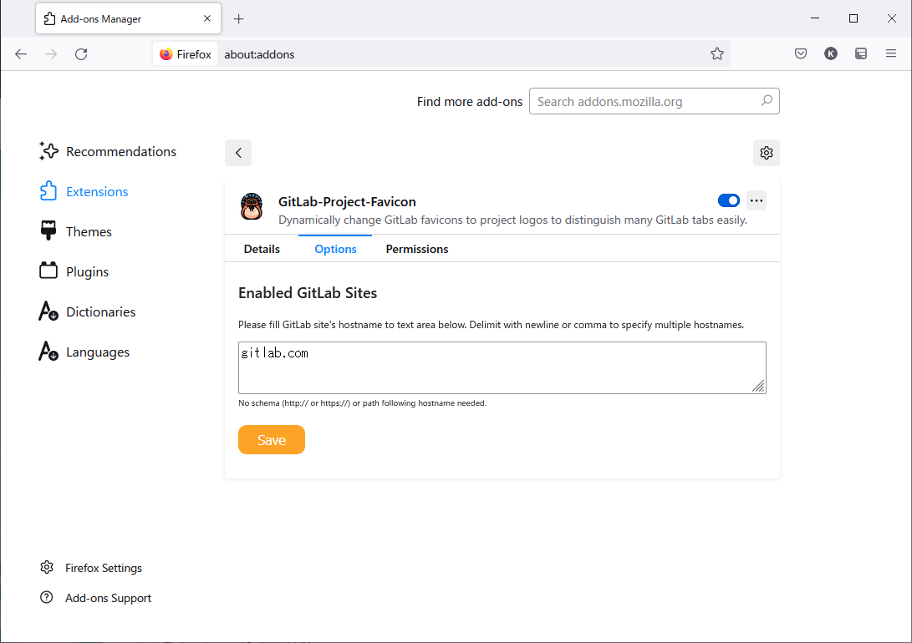
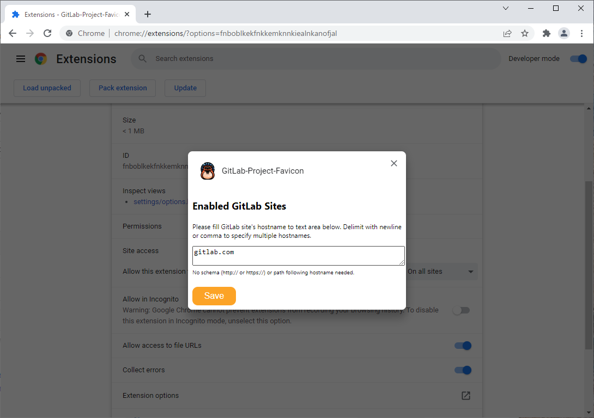

# gitlab-project-favicon

Dynamically change GitLab favicons to project logos to distinguish many GitLab tabs easily.

## Getting started

### On Firefox

1. Install extension from AMO: https://addons.mozilla.org/firefox/addon/gitlab-project-favicon/
1. Then, set which GitLab site (e.g. gitlab.com or your self-hosted site) you would like to change favicons. Go to the extension options page in [about:addons](about:addons) to set up.
   

### On Chrome

1. Install extension from Chrome Web Store: https://chrome.google.com/webstore/detail/gitlab-project-favicon/bakcfpilmcemknpdfdakmfnfikedmodh
1. Then, set which GitLab site (e.g. gitlab.com or your self-hosted site) you would like to change favicons. Go to the extension options page in [chrome://extensions](chrome://extensions) to set up.
   

## Acknowledgements

Raccoon icon that this project use is created by justicon - [Flaticon](https://www.flaticon.com/free-icons/raccoon).
