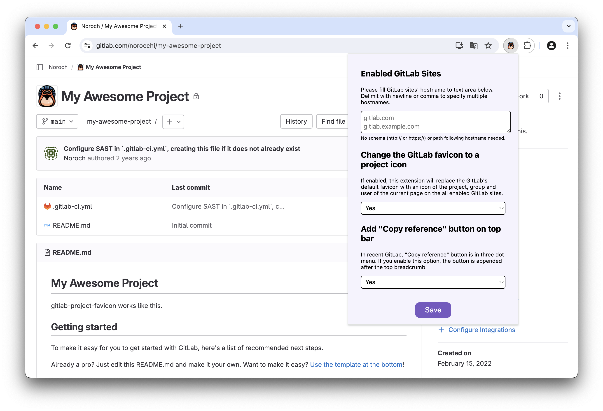

# tanuki-utilities (formerly gitlab-project-favicon)

## Features

* **Change the GitLab favicon to a project icon**; you can easily distinguish many GitLab tabs.  
    
  

## Getting started

### On Firefox

1. Install extension from AMO: https://addons.mozilla.org/firefox/addon/gitlab-project-favicon/
2. This extension tries to change favicons in the **all** sites by default. You can specify which GitLab site (e.g. gitlab.com or your self-hosted site) you would like to change favicons. Go to the extension options page in [about:addons](about:addons) to set up. If you set any values here, then the extension tries to change favicons only in the specified sites.
   

### On Chrome

1. Install extension from Chrome Web Store: https://chrome.google.com/webstore/detail/gitlab-project-favicon/bakcfpilmcemknpdfdakmfnfikedmodh
1. This extension tries to change favicons in the **all** sites by default. You can specify which GitLab site (e.g. gitlab.com or your self-hosted site) you would like to change favicons. Go to the extension options page in [chrome://extensions](chrome://extensions) to set up. If you set any values here, then the extension tries to change favicons only in the specified sites.
   

## Acknowledgements

Raccoon icon that this project use is created by justicon - [Flaticon](https://www.flaticon.com/free-icons/raccoon).
